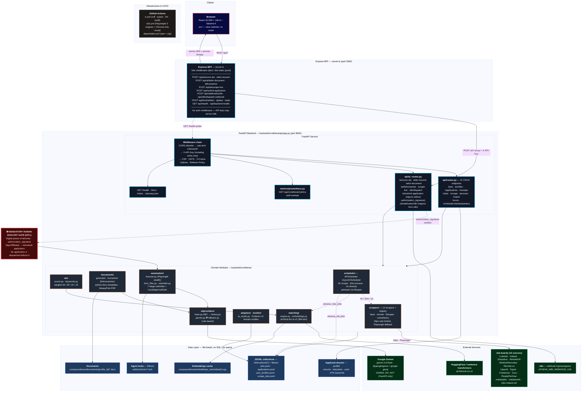
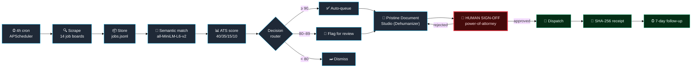

# Athena Platform — Architecture Diagram

> Athena v2.4.0 — Autonomous Job & Consultancy Engine (LightSpeed Holdings Ltd.)
> Source of truth: `backend/`, root `server.ts`/`src/`, `.github/workflows/`.

---

## 1. System Architecture

---

## 2. Core Pipeline Flow

The autonomous loop governed by the human sign-off gate:

---

## 3. Layer Reference

| Layer | Implementation | Entry point |
|---|---|---|
| **Presentation** | React 19 + Vite 8 + Tailwind 4, view switcher | `src/App.tsx` |
| **BFF / Proxy** | Express 4, single file | `server.ts` |
| **API / Backend** | FastAPI + Uvicorn + Pydantic v2 | `backend/src/athena/api/app.py` |
| **Domain** | Scrapers · matching · ATS · documents · automation · AI · scheduler | `backend/src/athena/` |
| **Data** | JSONL + `filelock` + in-memory cache | `backend/src/athena/store.py` |
| **Edge** | Express static + Vite middleware | `server.ts` |
| **Infra** | GitHub Actions (ruff · pytest · lint · build) | `.github/workflows/ci.yml` |

### Port map

| Service | Port |
|---|---|
| Express BFF + SPA (dev) | 3000 |
| FastAPI (local) | 8000 |
| FastAPI (E2E) | 8001 |
| Express (prod, `npm start`) | 3000 |

### Communication

REST/JSON only. **No GraphQL, gRPC, WebSocket, or message queue.**

- SPA path: browser → Express `/api/*` → FastAPI `/api/v1/athena/*` (proxied with `X-API-Key`)
- Auth: `X-API-Key` on FastAPI mutating verbs; Express injects key server-side
- Observability: Prometheus text at `/api/v1/athena/metrics` (auth-exempt)
- Locks: file-based in `artifacts/locks/`, served by Express

### Background jobs (APScheduler, in-process)

| Job | Interval | Work |
|---|---|---|
| `athena_scrape_jobs` | 4 hours | `run_all_scrapes()` across 14 sources |
| `athena_process_jobs` | 30 minutes | matching engine + ATS scorer |
| `athena_cleanup` | daily | `cleanup_old_jobs(days=90)` |

---

## 4. Known Discrepancies / Open Items

1. **Backend data empty** — `company/athena/` recreated empty; scrapers must run to populate.
2. **No deployment target** — runs locally via `npm run dev` (Express+FastAPI) or `npm start` (prod build).
3. **Frontend views still use mock data** — `src/App.tsx` loads from backend but falls back to mock; full wiring pending.
4. **n8n webhook URL** — `ATHENA_N8N_WEBHOOK_URL` not configured; ingress endpoint exists but untested.
5. **Docker/OCI removed** — `deploy/`, `docker-compose*.yml`, `.dockerignore` deleted; deployment TBD.

