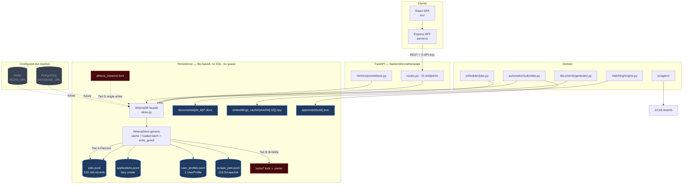
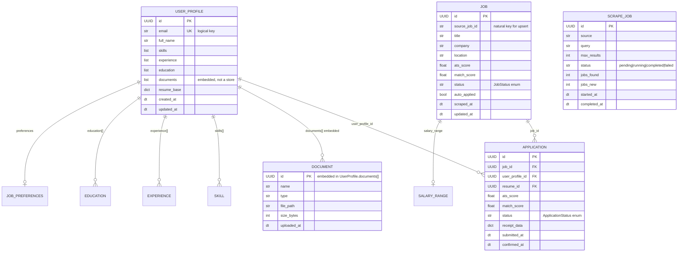
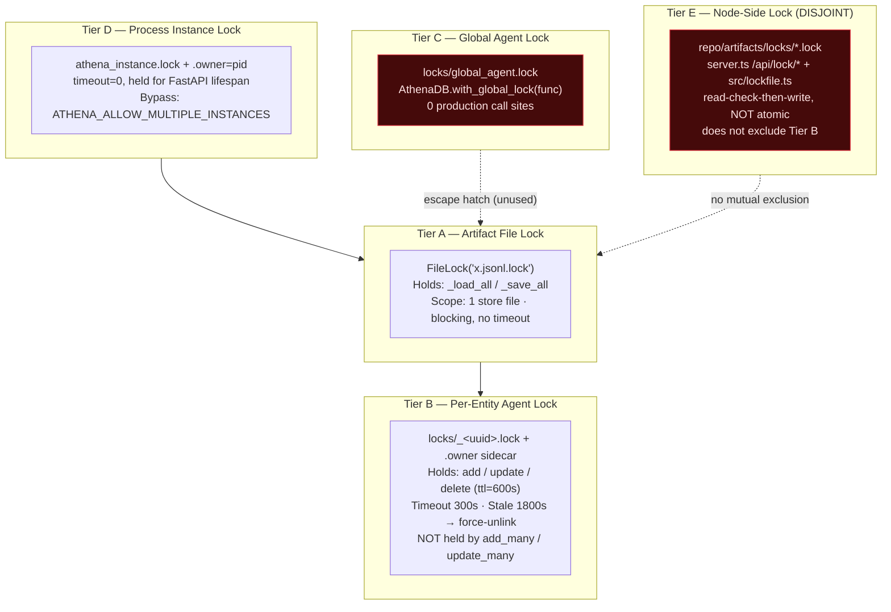
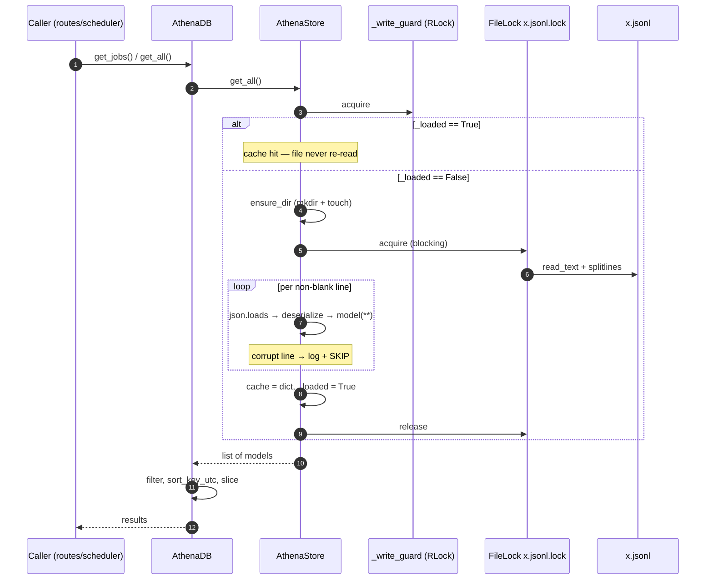
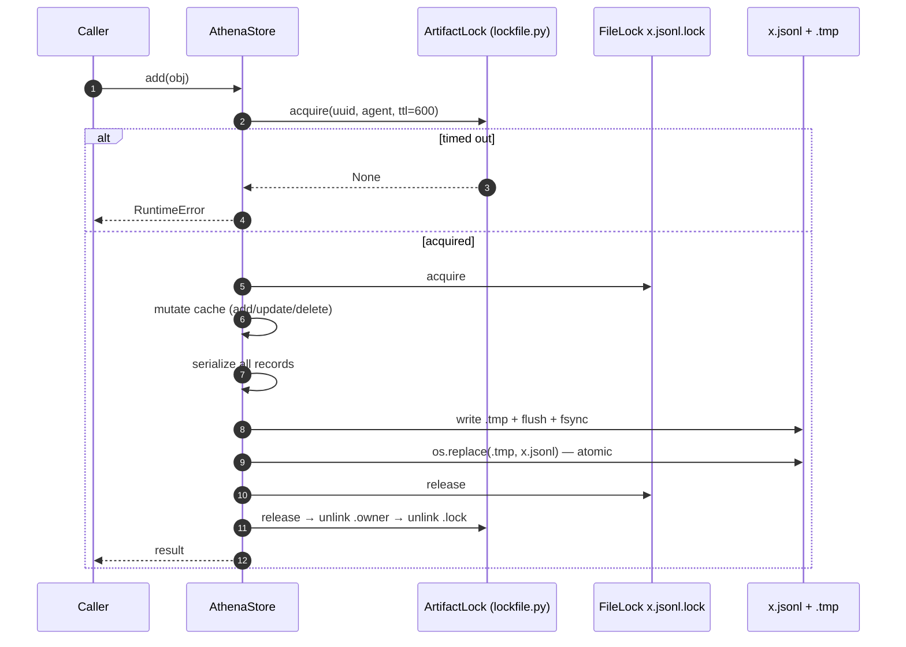
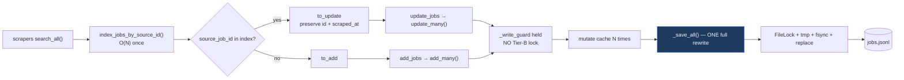
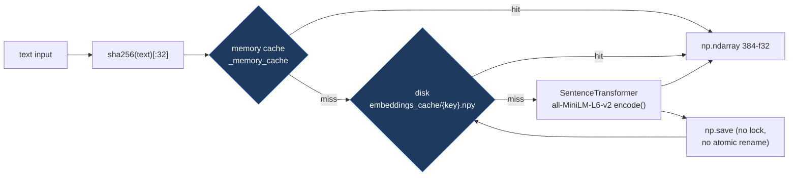

# Athena Data Stores and File Stores Architecture

This document provides diagrams and analysis of all databases and file stores in the Athena repository.

## 1. Data Root Resolution

The data root is resolved in `backend/src/athena/paths.py` with the following precedence:

| Priority | Source | Example |
|---|---|---|
| 1 | `ATHENA_DATA_DIR` env var | `C:\Users\jmlus\athena\company\athena` or `/app/data` (Docker) |
| 2 | `<repo>/company/athena` | Auto-resolved from repo root |
| 3 | `~/.athena/data` | Fallback |

---

## 2. All Stores Overview

| Store Type | Location | Purpose | Technology | Status |
|---|---|---|---|---|
| PostgreSQL | `DATABASE_URL` (prod config) | Production RDBMS | Relational DB | Configured only, not active |
| Redis | `REDIS_URL` (prod config) | Caching / rate limiting | Key-value | Configured only, not active |
| AthenaDB (JSONL) | `company/athena/*.jsonl` | Primary persistence | File-based JSONL + filelock | **Active** |
| Embeddings Cache | `company/athena/embeddings_cache/*.npy` | Vector cache | NumPy float32 files | **Active** |
| Lock files | `company/athena/locks/*.lock` | Agent coordination | `filelock` | **Active** |
| Instance lock | `company/athena/athena_instance.lock` | Single-writer guard | `filelock` (timeout=0) | **Active** |
| Documents | `company/athena/documents/{job_id}/*` | Generated DOCX/PDF | File system | **Active** |
| Approvals | `company/athena/approvals/{uuid}.json` | HITL gate requests | JSON files | **Active** |
| Node lock namespace | `<repo>/artifacts/locks/*.lock` | Express BFF locks | Read-check-write | **Active (disjoint)** |

---

## 3. Overall Data Architecture



---

## 4. Store Catalogue (JSONL Stores)

| Store | Filename | Model | Primary Key | Natural/Dedupe Key | Artifact Lock | Per-entity Locks |
|---|---|---|---|---|---|---|
| Jobs | `jobs.jsonl` | `Job` | `id` (UUID) | `source_job_id` | `jobs.jsonl.lock` | `locks/_<uuid>.lock` |
| Applications | `applications.jsonl` | `Application` | `id` (UUID) | `id` | `applications.jsonl.lock` | `locks/_<uuid>.lock` |
| UserProfiles | `user_profiles.jsonl` | `UserProfile` | `id` (UUID) | `email` (logical) | `user_profiles.jsonl.lock` | `locks/_<uuid>.lock` |
| ScrapeJobs | `scrape_jobs.jsonl` | `ScrapeJob` | `id` (UUID) | `id` | `scrape_jobs.jsonl.lock` | `locks/_<uuid>.lock` |

**Note:** All four stores use the same generic `AthenaStore[T]` class. Entity type derivation (`__class__.__name__.replace("AthenaStore", "")`) returns empty string, so per-entity lock files are named `_<uuid>.lock` with no store prefix.

---

## 5. Entity Relationships



**Important:** There are **no foreign keys, no constraints, no joins, no cascades**. Referential integrity is enforced in application code. `cleanup_old_jobs` deletes jobs without touching applications.

---

## 6. File Structure Layout

```text
ATHENA_DATA_DIR (e.g. company/athena/)
│
├── athena_instance.lock              Tier D single-writer guard (held open)
├── athena_instance.lock.owner        pid breadcrumb
│
├── jobs.jsonl                        679,820 B  ·  233 x Job
├── applications.jsonl                lazy — created on first touch
├── user_profiles.jsonl               27,983 B   ·  1 x UserProfile
├── scrape_jobs.jsonl                 90,111 B   ·  218 x ScrapeJob
│   └── <name>.jsonl.lock             Tier A: FileLock guard per artifact
│
├── locks/                            LOCK_DIR (get_data_root()/"locks")
│   ├── _<uuid>.lock                  Tier B: per-entity artifact lock
│   ├── _<uuid>.lock.owner            agent_id + acquired_at + ttl
│   └── global_agent.lock             Tier C: with_global_lock (unused)
│
├── documents/{job_id}/
│   ├── {Company}-{Title}-resume.docx
│   └── {Company}-{Title}-cover_letter.docx
│
├── embeddings_cache/{sha256(text)[:32]}.npy   1,664 B = 384 x float32
└── approvals/{uuid}.json                      HITL gate request

DISJOINT NAMESPACES (not covered by the instance lock):
  <repo>/artifacts/locks/*.lock       Express server.ts + src/lockfile.ts
  backend/artifacts/locks/*.lock      orphans from tmp-data-dir test runs
```

---

## 7. Lock Tiers



| Tier | Name | Scope | Timeout | Purpose |
|---|---|---|---|---|
| A | Artifact file lock | Per JSONL file | Infinite (blocking) | `_load_all()`, `_save_all()` |
| B | Per-entity agent lock | Per UUID | 300s (stale 1800s) | `add()`, `update()`, `delete()` |
| C | Global agent lock | Global | 300s | `with_global_lock()` (unused) |
| D | Process instance lock | Process-wide | 0 (fail-fast) | FastAPI lifespan guard |
| E | Node-side lock | Disjoint (`artifacts/locks/`) | HTTP-based | Express BFF locks |

---

## 8. Read Path (Load-Once Cache)



**Key invariant:** `_loaded` latches on first access and is never invalidated. Cross-process correctness relies on the Tier D instance lock.

---

## 9. Single-Record Write Path



---

## 10. Batch Write Path (Optimization)



**Key difference:** `add_many()`/`update_many()` take **zero** Tier-B locks — they hold only `_write_guard` and perform a single full-file rewrite. Individual `add()`/`update()`/`delete()` each take a Tier-B lock and rewrite the whole file (O(N) per record).

---

## 11. Embeddings Cache



| Aspect | Value |
|---|---|
| Path | `company/athena/embeddings_cache/` |
| Filename | `{sha256(text.encode()).hexdigest()[:32]}.npy` |
| Format | NumPy float32 (384-dim, `all-MiniLM-L6-v2`) |
| Size | ~1,664 bytes per file |
| Caching | In-memory dict + on-disk `.npy` (two levels) |
| Concurrency | No locks; silent failures on I/O |

---

## 12. JSONL Serialization Format

- **Format:** One compact JSON object per line, joined by `\n` (no trailing newline)
- **Serialization:** `UUID`/`Decimal`/`HttpUrl` → `str()`; `datetime` → UTC ISO 8601; `Enum` → `.value`
- **Deserialization:** keys ending `_at` → ISO datetime + UTC; keys == id or ending `_id` → `UUID(v)`
- **Persistence:** atomic write via `.tmp` + `os.fsync()` + `os.replace()`

---

## 13. Key Design Characteristics

- **Load-once cache:** `_loaded` latches on first access; file never re-read in process lifetime.
- **Full-artifact rewrite:** every single-record write rewrites the entire JSONL file.
- **Atomic writes:** temp file + `fsync()` + `os.replace()`.
- **UTC normalization:** all timestamps serialized as UTC-aware ISO 8601.
- **Corrupt lines skipped:** malformed lines are logged and skipped, not fatal.
- **Import-time lock dir:** `LOCK_DIR` set at `lockfile.py` import; differs from runtime `base_dir` in tests.
- **Two lock namespaces:** Python (`company/athena/locks/`) and Node (`artifacts/locks/`) are disjoint.
- **ScrapeJob status** is a plain `str` (`pending|running|completed|failed`), unlike the `JobStatus` enum.

---

*Generated from analysis of `store.py`, `lockfile.py`, `paths.py`, `models/`, `matching/embeddings.py`, `api/app.py`, `server.ts`.*
